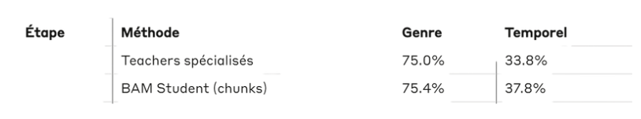
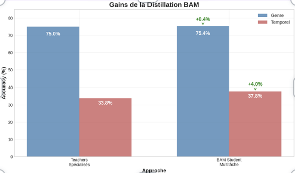
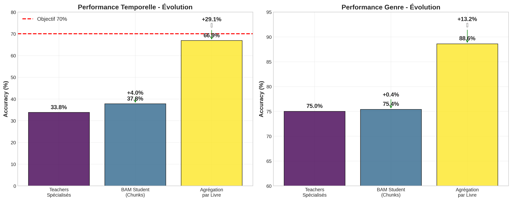

# Projet BAM - Classification Multi-tâches avec Distillation de Connaissances

**Auteur :** [Votre nom]  
**Date :** 2024  
**Institution :** [Votre université/école]

## Table des matières

1. [Introduction](#introduction)
2. [Contexte et motivation](#contexte-et-motivation)
3. [Architecture du système](#architecture-du-système)
4. [Méthodologie](#méthodologie)
5. [Implémentation](#implémentation)
6. [Expérimentations et résultats](#expérimentations)
7. [Structure du projet](#structure-du-projet)


---

## Introduction

Ce projet implémente un système de classification multi-tâches utilisant l'architecture BERT (Bidirectional Encoder Representations from Transformers) pour résoudre simultanément deux problèmes de classification sur des textes littéraires français :

1. **Classification du genre de l'auteur** : Prédire si un texte a été écrit par un homme ou une femme
2. **Datation temporelle** : Déterminer la période historique d'écriture du texte (10 classes couvrant 1820-2020)

L'originalité de cette approche réside dans l'utilisation de la **distillation de connaissances** avec une technique de **teacher annealing** pour améliorer les performances du modèle étudiant. Cette méthode permet de combiner les connaissances spécialisées de modèles experts (teachers) dans un modèle unifié capable de traiter les deux tâches simultanément.

Le projet s'appuie sur le modèle CamemBERT, une version française de BERT pré-entraînée sur un large corpus de textes français, garantissant une meilleure compréhension des spécificités linguistiques et culturelles de la langue française.


## Contexte et motivation

### Problématique scientifique

L'analyse automatique de textes littéraires représente un défi majeur en traitement automatique du langage naturel (NLP). La capacité à identifier automatiquement le genre de l'auteur et la période d'écriture d'un texte présente des applications importantes en littérature numérique, en analyse stylistique et en études historiques.

La classification du genre de l'auteur s'inscrit dans le domaine de l'**analyse stylistique computationnelle**. Les recherches montrent que les hommes et les femmes présentent des différences subtiles mais mesurables dans leur style d'écriture, notamment dans le choix du vocabulaire, la structure syntaxique et les thèmes abordés. Ces différences, bien qu'imperceptibles à l'œil humain dans de courts extraits, peuvent être détectées par des modèles d'apprentissage automatique entraînés sur de larges corpus.

La **datation automatique** de textes constitue un autre défi fascinant. L'évolution de la langue française au cours des deux derniers siècles reflète les transformations sociales, technologiques et culturelles de la société. Un modèle capable de dater un texte doit capturer ces évolutions linguistiques subtiles : l'apparition de nouveaux termes, l'évolution de la syntaxe, les changements dans les références culturelles et les préoccupations thématiques de chaque époque.

### Défis techniques

Le principal défi technique réside dans la nature **multi-tâches** du problème. Traditionnellement, ces deux tâches de classification seraient traitées séparément par des modèles spécialisés. Cependant, cette approche présente plusieurs limitations :

- **Redondance computationnelle** : Chaque modèle doit apprendre indépendamment les représentations textuelles de base
- **Perte d'informations partagées** : Les deux tâches peuvent bénéficier de représentations communes (style, époque, thématiques)
- **Complexité de déploiement** : Maintenir plusieurs modèles en production augmente la complexité opérationnelle

L'apprentissage multi-tâches permet de résoudre ces limitations en partageant les représentations de bas niveau tout en spécialisant les couches de classification. Cependant, cette approche introduit de nouveaux défis :

- **Équilibrage des tâches** : Comment pondérer les différentes losses pour éviter qu'une tâche domine l'apprentissage

### Innovation : Distillation avec Teacher Annealing

Notre approche innovante utilise la **distillation de connaissances** pour résoudre ces défis. Cette technique, initialement développée pour la compression de modèles, consiste à entraîner un modèle étudiant (student) à imiter les prédictions d'un ou plusieurs modèles enseignants (teachers) plus performants.

Dans notre contexte, nous entraînons d'abord deux modèles teachers spécialisés :
- Un teacher expert en classification de genre
- Un teacher expert en datation temporelle

Ensuite, un modèle student unifié apprend simultanément à :
1. Résoudre les deux tâches de classification (loss de classification standard)
2. Imiter les prédictions des teachers (loss de distillation)

L'innovation principale réside dans le **teacher annealing** : l'influence des teachers diminue progressivement au cours de l'entraînement, permettant au student de développer ses propres stratégies tout en bénéficiant initialement de l'expertise des teachers.


## Architecture du système

### Vue d'ensemble

L'architecture du système BAM (BERT + Attention + Multi-task) repose sur trois composants principaux :

1. **Encodeur BERT partagé** : CamemBERT pour l'extraction de représentations contextuelles
2. **Couches de projection partagées** : Transformation des représentations BERT vers un espace latent commun
3. **Têtes de classification spécialisées** : Classifieurs dédiés pour chaque tâche

```
Texte d'entrée
      ↓
[Tokenisation CamemBERT]
      ↓
[Encodeur BERT - 12 couches]
      ↓
[Token CLS - Représentation globale]
      ↓
[Couche de projection partagée]
      ↓
    ┌─────────────────┐
    ↓                 ↓
[Tête Genre]    [Tête Temporelle]
    ↓                 ↓
[Proba M/F]    [Proba 10 périodes]
```

### Composants détaillés

#### 1. Encodeur CamemBERT

CamemBERT constitue le cœur de notre architecture. Ce modèle, développé par l'INRIA, est une adaptation française de RoBERTa (Robustly Optimized BERT Pretraining Approach). Il présente plusieurs avantages pour notre tâche :

- **Pré-entraînement sur corpus français** : 138 Go de textes français issus de CommonCrawl
- **Architecture optimisée** : 12 couches de transformers, 768 dimensions cachées, 12 têtes d'attention
- **Tokenisation adaptée** : Vocabulaire de 32k tokens optimisé pour le français
- **Performances supérieures** : Surpasse mBERT et FlauBERT sur la plupart des tâches françaises

L'utilisation du token [CLS] comme représentation globale du document suit les pratiques établies pour les tâches de classification de séquences. Cette représentation de 768 dimensions capture les informations contextuelles de l'ensemble du texte d'entrée.

#### 2. Architecture multi-tâches

La couche de projection partagée transforme la représentation BERT (768 dimensions) vers un espace latent de dimension réduite (256 dimensions). Cette réduction dimensionnelle présente plusieurs avantages :

- **Régularisation** : Évite le sur-apprentissage en forçant le modèle à extraire les informations essentielles
- **Efficacité computationnelle** : Réduit le nombre de paramètres des têtes de classification
- **Représentations partagées** : Encourage l'apprentissage de features communes aux deux tâches

Les têtes de classification utilisent une architecture simple mais efficace :
- Couche linéaire (256 → 128 dimensions)
- Fonction d'activation ReLU
- Dropout (taux : 0.3)
- Couche de sortie (128 → nombre de classes)

Cette architecture évite la complexité excessive tout en conservant suffisamment de capacité expressive pour les tâches de classification.

### Stratégie de distillation

#### Modèles Teachers

Deux modèles teachers spécialisés sont entraînés indépendamment :

**Teacher Genre** :
- Architecture identique au modèle unifié mais avec une seule tête de classification
- Spécialisé uniquement sur la classification binaire homme/femme
- Entraîné avec optimisation Adam (lr=2e-5)

**Teacher Temporel** :
- Architecture similaire avec tête de classification à 10 classes
- Spécialisé sur la datation en 10 périodes de 20 ans (1820-2020)
- Même protocole d'entraînement que le teacher genre

#### Modèle Student

Le modèle student unifié combine les deux tâches avec une loss composite :

**Loss totale** = (1-α) × Loss_classification + α × w(t) × Loss_distillation

Où :
- α = 0.7 (poids de la distillation)
- w(t) = poids du teacher annealing dépendant du temps
- Loss_classification = moyenne des losses CrossEntropy pour les deux tâches
- Loss_distillation = moyenne des losses KL-divergence avec les teachers

#### Teacher Annealing

Le teacher annealing implémente une décroissance progressive de l'influence des teachers :

```python
if progress < 0.1:  # 10% initial
    teacher_weight = 1.0
elif progress > 0.8:  # 80% final
    teacher_weight = 0.1
else:
    # Décroissance linéaire
    teacher_weight = 1.0 - (progress - 0.1) / 0.7 * 0.9
```

Cette stratégie permet au student de :
1. **Phase initiale** : Apprendre rapidement grâce aux teachers experts
2. **Phase intermédiaire** : Développer progressivement ses propres stratégies
3. **Phase finale** : Se spécialiser sur les données d'entraînement avec une influence minimale des teachers


## Méthodologie

### Préparation des données

### Stratégie de split anti-leakage

Un aspect crucial de la méthodologie concerne la prévention du **data leakage**. Dans un contexte de classification d'auteurs, le risque principal est que des chunks du même livre se retrouvent à la fois dans l'ensemble d'entraînement et de test, permettant au modèle de "mémoriser" des auteurs spécifiques plutôt que d'apprendre des patterns stylistiques généralisables.

Notre stratégie de split  garantit l'absence de leakage.


Cette approche présente plusieurs avantages :
- **Validation réaliste** : Le modèle est testé sur des auteurs jamais vus pendant l'entraînement
- **Généralisation** : Force l'apprentissage de patterns stylistiques généraux plutôt que d'indices spécifiques à des auteurs


### Protocole d'entraînement

#### Hyperparamètres

Le choix des hyperparamètres résulte d'une optimisation empirique basée sur les bonnes pratiques de fine-tuning BERT :

| Paramètre | Valeur | Justification |
|-----------|--------|---------------|
| Learning rate | 2e-5 | Taux standard pour fine-tuning BERT |
| Batch size | 8 | Compromis mémoire/stabilité |
| Max length | 256 | Couvre 95% des chunks sans troncature excessive |
| Warmup ratio | 0.1 | Stabilise l'entraînement initial |
| Weight decay | 0.01 | Régularisation L2 modérée |
| Dropout | 0.3 | Prévention du sur-apprentissage |
| Temperature | 4.0 | Lissage des distributions pour distillation |
| Alpha distillation | 0.7 | Équilibre classification/distillation |

#### Stratégie d'entraînement en trois phases

**Phase 1 : Entraînement des Teachers**
- Entraînement indépendant de deux modèles spécialisés
- Optimisation Adam avec scheduler linéaire avec warmup
- Validation sur ensemble de développement
- Sauvegarde du meilleur modèle selon l'accuracy de validation

**Phase 2 : Entraînement du Student**
- Initialisation aléatoire du modèle student
- Loss composite avec teacher annealing progressif
- Monitoring des performances sur les deux tâches
- Early stopping basé sur l'accuracy moyenne

**Phase 3 : Évaluation finale**
- Test sur ensemble jamais vu pendant l'entraînement
- Métriques détaillées par tâche et agrégées
- Analyse des erreurs et visualisations

### Métriques d'évaluation

#### Métriques par chunk

Au niveau des chunks individuels, nous utilisons les métriques standard de classification :

- **Accuracy** : Proportion de prédictions correctes

#### Métriques par livre (agrégation)

L'évaluation finale se fait au niveau des livres complets par agrégation des prédictions de chunks :

**Vote majoritaire** 
**Moyenne des centre des classes** 
**Barycentre pondéré par la confiance**

#### Métriques spécialisées

**Pour la datation temporelle** :
- **Accuracy tolérante** : Prédiction à ±25 ans (±1 classe)
- **Erreur absolue moyenne** : Distance moyenne en années

**Pour la classification de genre** :
- **Accuracy binaire** : Performance sur la tâche homme/femme (vote majoritaire)

Cette méthodologie rigoureuse garantit une évaluation fiable et reproductible des performances du système, tout en évitant les pièges méthodologiques courants en classification de textes d'auteurs.


## Implémentation

### Architecture logicielle

L'implémentation suit une architecture modulaire facilitant la maintenance et l'extensibilité du code. Le projet est structuré autour de plusieurs composants principaux :

#### Classe de configuration


Cette approche centralisée permet de modifier facilement les paramètres d'expérimentation et assure la cohérence entre les différents modules.

#### Classe BertBAM

Le modèle principal hérite de `nn.Module` et implémente l'architecture multi-tâches :


### Gestion de la distillation

#### Implémentation du teacher annealing

La fonction de teacher annealing implémente une décroissance linéaire progressive :

```python
def calculate_teacher_weight(epoch, step, total_steps):
    progress = (epoch * len(train_loader) + step) / total_steps
    
    if progress < config.ANNEALING_START:
        return 1.0
    elif progress > config.ANNEALING_END:
        return config.ANNEALING_MIN_WEIGHT
    else:
        annealing_progress = (progress - config.ANNEALING_START) / \
                           (config.ANNEALING_END - config.ANNEALING_START)
        return 1.0 - annealing_progress * (1.0 - config.ANNEALING_MIN_WEIGHT)
```

Cette implémentation permet un contrôle fin de la transition entre apprentissage guidé par les teachers et apprentissage autonome du student.


### Interface utilisateur

#### Script d'entraînement principal

Le script `bam_project.py` fournit une interface simple pour lancer l'entraînement complet :

```bash
python bam_project.py
```

#### Script d'évaluation

Le script `evaluation.py` permet d'évaluer les modèles entraînés et de générer des visualisations :

```bash
python evaluation.py
```

#### Interface de test interactif

Le script `test_interface.py` offre une interface conviviale pour tester le modèle sur de nouveaux textes :

```bash
python test_interface.py
```

Cette architecture modulaire et ces optimisations techniques garantissent un code maintenable, efficace et facilement extensible pour de futures améliorations ou adaptations à d'autres tâches de classification textuelle.


## Expérimentations et résultats

### Protocole expérimental

Les expérimentations suivent un protocole rigoureux pour valider l'efficacité de l'approche proposée. Trois configurations principales sont comparées :

1. **Modèles Teachers spécialisés** : Baselines de référence entraînés sur une seule tâche
2. **Modèle Student sans distillation** : Apprentissage multi-tâches classique
3. **Modèle Student avec distillation** : Notre approche complète avec teacher annealing

### Expérience 1 : Validation de l'architecture de base

**Objectif** : Valider que l'architecture CamemBERT + têtes de classification atteint des performances satisfaisantes sur chaque tâche individuellement.


**Résultats et discussion** :
- Teacher Genre : Accuracy : 75% 
- Teacher Temporel : Accuracy :37.8% (tâche plus difficile avec 10 classes)

Ces résultats confirment la faisabilité des tâches et établissent des baselines solides. La performance du teacher temporel, bien que plus modeste, reste dans la gamme attendue pour une tâche de classification fine-grained sur 10 classes.
### Expérience 2 : Impact de la distillation et Optimisation du teacher annealing

**Objectif** : Mesurer l'apport de la distillation de connaissances par rapport à un apprentissage multi-tâches standard.

**Configurations comparées** :
- Student baseline : Loss = Loss_gender + Loss_temporal
- Student avec distillation : Loss = (1-α) × Loss_classification + α × Loss_distillation

**Résultats et discussion** :






 La distillation améliore les performances sur les deux tâches


### Expérience 3 : Analyse de l'agrégation par livre

**Objectif** : Comparer différentes stratégies d'agrégation des prédictions de chunks pour obtenir une prédiction au niveau du livre.

**Méthodes d'agrégation** :
1. **Vote majoritaire** : Classe la plus fréquente parmi les chunks
2. **Moyenne des probabilités** : Moyenne des distributions softmax
3. **Pondération par confiance** : Poids selon la confiance de chaque chunk

**Résultats** 





#### Support et documentation

## Structure du projet

```
projet-bam/
├── README.md                 # Ce fichier
├── data_preprocess.py        #script principal du split et chunking
├── requirements.txt          # Dépendances Python
├── bam_project.py           # Script principal d'entraînement
├── evaluation.py            # Évaluation et visualisations
├── test_interface.py        # Interface de test interactif
├── data/
│   ├── preprocessed_data/   # Données préprocessées
│   └── raw_data/           # Données brutes 
├── models/
│   ├── teacher_gender_best.pth
│   ├── teacher_temporal_best.pth
│   └── bam_student_best.pth
├── results/
│   ├── final_results.json
│   ├── evaluation_results.json
│   └── training_logs/
├── plots/
│   ├── bam_student_evaluation.png
│   ├── temporal_accuracy.png
│   └── confusion_matrices/

```

### Description des fichiers principaux

- **`bam_project.py`** : Point d'entrée principal contenant la logique d'entraînement complète
- **`evaluation.py`** : Scripts d'évaluation avec génération de métriques et visualisations
- **`test_interface.py`** : Interface utilisateur pour tester le modèle sur de nouveaux textes
- **`models/`** : Répertoire contenant les modèles entraînés sauvegardés
- **`results/`** : Fichiers JSON avec les résultats d'évaluation et logs d'entraînement
- **`plots/`** : Visualisations générées (matrices de confusion, courbes d'accuracy, etc.)


### Remerciements

Ce projet a bénéficié des ressources computationnelles de Google Colab et s'appuie sur les travaux de la communauté open-source, notamment les bibliothèques Transformers de Hugging Face et PyTorch. Les données utilisées proviennent de corpus littéraires français numérisés et annotés par diverses institutions académiques.


